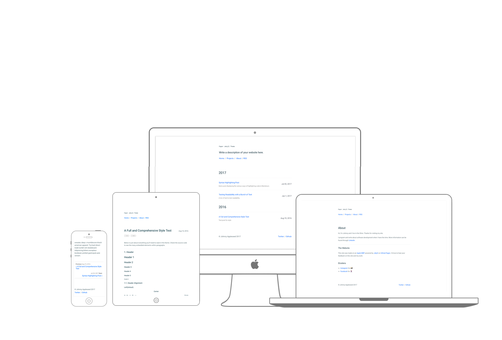

<p align="center">
  
  <p align="center">
  <a href=http://atomicnumber1.com>atomicnumber1</a>
  <br>
  <br>
  <a href="https://travis-ci.org/atomicnumber1/atomicnumber1.github.io"></a>
  <a href="https://raw.githubusercontent.com/atomicnumber1/atomicnumber1.github.io/master/LICENSE"></a>
  </p>
</p>
<br>


## Features
- Compatible with Jekyll 3.x and **Github Pages**
- Live local reloading for faster development
- **Responsive layout** built-in
- Supports Jekyll's built-in Sass/SCSS preprocessor
- Supports **Google Analytics**
- Supports **Disqus** for commenting
- Minimum Dependencies
- Rakefile for automation
    - `rake check`    - Check links/html files of the generated site
    - `rake clean`    - Clean up generated site
    - `rake post`     - Begin a new post in `./_posts`
    - `rake preview`  - Preview with livereload on local machine

## Usage
```
git clone https://github.com/atomicnumber1/atomicnumber1.github..git
bundle install
rake preview
```

Then, go to your favorite brower and type in the address `http://127.0.0.1:YOUR_PORT_NUM_HERE` to preview your website.

### Customization
To customize various details - title/description of the website, your SNS accout names, etc - edit the `_config.yml` file.

### Adding posts
```
rake post title="A Title" [date="2012-02-09"] [tags=[tag1,tag2]] [category="category"]
```
This will create a markdown file in the default folder where all posts are stored in Jekyll; `_post`.

If you wish to **change the directory where posts are saved**, go to the `Rakefile` and edit the `CONFIG = { 'posts': CUSTOM_PATH_HERE }`. This will allow `rake post` to know where to save the new posts to.

The **drafts** you are working on can be saved in the `_drafts` directory. When you push your code to the server, files in this directory will NOT be included to the list o posts.

